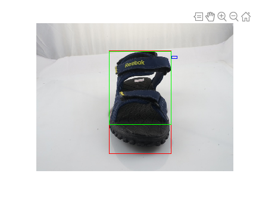

This is my submission for the Flipkart object localization challenge, where it was required to build a bounding box around an object. For example:

Broadly, we use 3 different implementations of Blob Analysis, as described below:

1. First approach focusses on seperating the object from background. It works best when there is a good contrast between object and background.
   This model detects object using edge detection and basic morphology. It suffers when trying to detect irregular and dark objects.
   
2. This model works best for dark and regular objects. We simply try to extract the darkest pixels from the image, and see if that make up the object.
   This model suffers many performance issues for light objects.

3. This model tries to isolate background from the main object. The apprach is similar to model 1, with minor changes which enable detection of slightly dark
   but irregular objects as well.    
   
Models 1 & 3 work by converting the original image into a binary image, while Model 2 works by converting image into a grayscale image.
   
Finally, we select as our answer the model which generates the largest bounding box.

The resulting bounding box coordinate are stored in result.csv file.

We used MATLAB for this project.
In MATLAB, we made use of Image Processing Toolbox.

The score generated in 3rd round is 0.70/1.

Advantages:
- A really light algorithm, which can be implemented on daily use PCs
- Simple and Clutter Free

Disadvantages:
- The model fails when there is less contrast between background and the object
- Sometimes, the result could be actually overfitted, as its possible that one of the 3 model generates the largest but wrong bounding box.

The entire model takes about 20 minutes to generate results on my PC, with 8 GB DDR4 RAM and 2.3 Ghz Intel I5 quad core processor.  

We decided against using a Machine Learning Algorithm, such as Convolution Neural Networks, as I won't be able to efficiently implement them with the processing
power available with me. We frequently got memory errors while trying to implement such a ML method.

The competition was available [here](https://dare2compete.com/o/Flipkart-GRiD-Teach-The-Machines-2019-74928?utm_source=TPOs&utm_medium=Mailer&utm_campaign=FlipkartGrid&fbclid=IwAR2obeQBaqIOHlsdCR0TcmTJwNwJHK14L7Rlnm1_nb4aGQHfjNuCo6L89dg)

 

